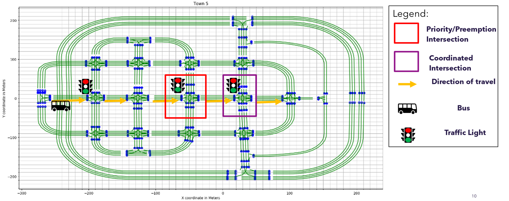
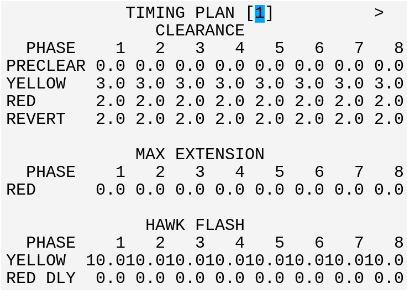
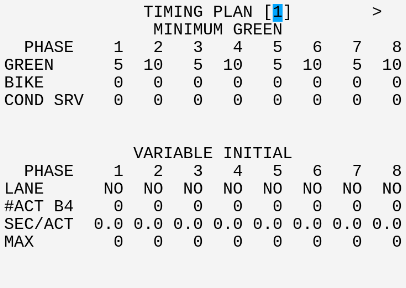
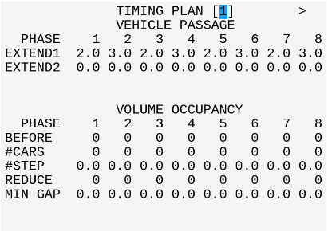
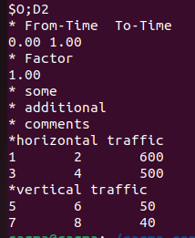
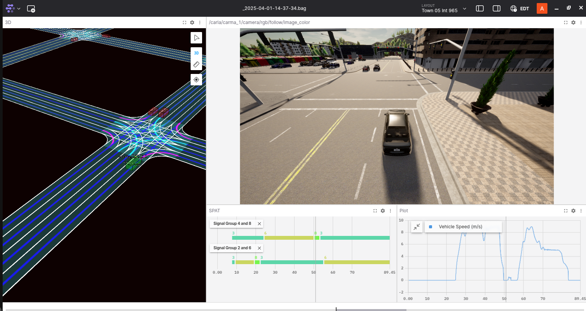

# Town05 TIM/TSP

## Introduction

This **CARMA Config** includes the docker-compose and configuration file setup for the **Town05 TIM/TSP** scenario.

## Scenario Description

This CARMA Configuration Image creates a **XIL** (Anything-In-the-Loop) scenario which includes **CARLA**, **SUMO** , **NS3** (CV2X Model), a **Virtual Signal Controller** and **CARMA Platform**.  The scenario takes place in an intersection in **CARLA Town 5** and spawns 1 **CARMA Platform Vehicle**.

### Scenario: TIM/TSP

## Simulators

| Simulator      | Version |
| ----------- | ----------- |
| CARLA      | 0.9.10       |
| SUMO      | 1.15       |
| EVC       | 0.9.2 |

## EVC Configuration





The configuration shows above will apply to 421.cfg, 685.cfg and 965.cfg

## Sumo Background Traffic
The scenario starts with no background Sumo traffic, but a route file for Sumo background traffic can be generated and added as a docker volume in the `xil-Town05/docker-compose.yml'` to add sumo background traffic in the simulation

There are two ways to generate the SUMO background traffic route file `Town05.rou.xml`  for this scenario:

1. Utilizing Sumo's `randomTrips.py` tools generate random traffic running in Sumo
2. Utilizing Sumo's `od2trips` tools by defining origin and destination matrix (OD matrix)

### Random Traffic using `randomTrips.py`
Run the script `generate_random_background_traffic.sh` located in the `xil-Town05/cdasim_config/sumo_background_traffic/` to generate random background traffic. This script takes simulation duration, number of vehicles and a random number seed to generate a route file mapping with Carla vehicle types. The minimum straight line distance of the each vehicle route is atleast 300 m. The script takes command line arguments  of simulation duration, number of vehicles and a random number seed and if command line arguments are not provided asks for interactive inputs.

#### Prerequisites:
Sumo tools needs to be installed for running the following script. To install Sumo tools use the command:
`sudo apt-get install sumo-tools `

#### Running the script with Command Line Arguments
Use the following command

`./generate_random_background_traffic.sh simulation_duration number_of_vehicles random_number_seed`

If command line arguments are not provided the script asks for the simulation duration, number of vehicles ,a random number seed and generates the `Town05.rou.xml` in the same directory

### Utilizing `od2trips` to generate Background Traffic
The script `generate_route_from_OD_matrix.sh` located in the `xil-Town05/cdasim_config/sumo_background_traffic/`  utilizes sumo  [od2trips](https://sumo.dlr.de/docs/od2trips.html) tool to generate background traffic for Town05 given Traffic assignment zones (TAZ) and OD matrix
#### Prerequisites
This script also requires Sumo tools od2trips and duarouter and sumo tools can installed  using the command: ` sudo apt-get install sumo-tools `
#### OD Matrix


1. To change the number of vehicles in the horizontal (main artery ) or vertical direction (going through intersection 965) in Sumo Town05, modify the values in the third column of OD_file.od, which specify the number of vehicles
2. Re-run the generate_route.sh script to generate the route file with the updated vehicle counts.
3. New traffic Assignment zones (Tazs) can also be added in the `Taz.xml` and new Tazs can be used as origins and destinations in `OD_file.od` to generate vehicle trips in those TAZs. For a detailed guideline, refer to SUMO od2trips [documentation](https://sumo.dlr.de/docs/od2trips.html)

### Adding generated Background Traffic to CDASim
To add Sumo background traffic generated follwoing either of the previous steps the `docker-compose.yml` files need to updated. To add the `Town05.rou.xml` route file open the `docker-compose.yml` file and add a docker volume using ` - ./sumo_background_traffic/Town05.rou.xml:/opt/carma-simulation/scenarios/Town05/sumo/Town05.rou.xml `. The updated volume in `docker-compose.yml` should like like as below:

```YAML
volumes:
      - /tmp/.X11-unix:/tmp/.X11-unix
      - /opt/carma-simulation/logs:/opt/carma-simulation/logs
      - ./carla-recorder/:/app/scenario_runner/metrics/data/
      - ./cdasim/logback.xml:/opt/carma-simulation/etc/logback.xml
      - ./sumo_background_traffic/Town05.rou.xml:/opt/carma-simulation/scenarios/Town05/sumo/Town05.rou.xml
```
Build the image  using `./build_image.sh` shown in the deployment instruction and this will replace the existing `Town05.rou.xml` with the newly generated route file in CDASim and when the scenario is deployed the background traffic will appear in the simulation.

### Turning off Background Traffic
To turnoff background traffic in Town05 just comment out the added ` - ./sumo_background_traffic/Town05.rou.xml:/opt/carma-simulation/scenarios/Town05/sumo/Town05.rou.xml `  and build the image again using `./build_image.sh` shown in the deployment instruction

## Deployment Instructions
### Deployment Steps
1) Copy all files in the `xil-Town05/cdasim_config/route_config/` directory to `/opt/carma/routes/`
2) Navigate to `xil-Town05` and `./build_image.sh` to build CARMA Config image. (Optional if remote image exists)
   1) `./build_image.sh` should print resulting image name
3) Run `carma config set <carma-config-image-name>`
4) Navigate to the `cdasim_config/` directory.
5) `./run_simulation` script clears all necessary volumes and containers and runs `carma start all`
6) Launch a second terminal and run `./stop_simulation` to stop the simulation and collect data.
### Locally Built Docker Images
The Virtual Signal Controller is built locally and currently only available to licenced users.

## Testing and Evaluation
CDASim is a testing environment that allows users to test and evaluate CDA UC functionality and performance.
> [!IMPORTANT]
> To ensure proper collection of all data for simulation please use `./start_simulation` and `./stop_simulation` scripts respectively

### Data Collection
#### CARMA Platform
Both service logs and ros bags logs can be found under `/opt/carma/logs/`
### CDASim
Service logs can be found under `/opt/carma-simulation/logs/`. After running `./stop_simulation`, RTF (Real Time Factor) data will be collected in a csv file showing simulation time step speed.
### CARMA Streets
Service logs can be found under `./cdasim_config/<streets_service_name>/logs`. After running `./stop_simulation` Kafka logs will be collected and added to a zip file under `./cdasim_config/`
### Data Analysis
Data processing and analysis scripts for plotting collected data from CARMA Streets and CARMA Platform can be found [here](https://github.com/usdot-fhwa-stol/carma-analytics-fotda/tree/develop/src). Additionally under `./cdasim_config/foxglove` we have provided a dashboard configuration which can be used with rosbags collected in this scenario to replay the data and plot CARLA and CARMA Platform Data. For more information about how to use fox glove (https://foxglove.dev/)



